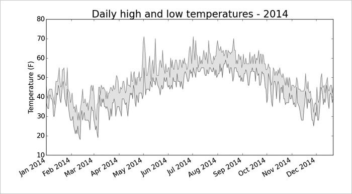
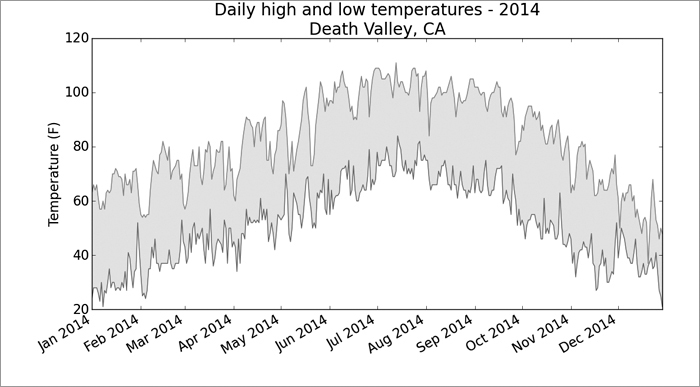

# Downloading Data

In this chapter you’ll download data sets from online sources and create
working visualizations of that data. An incredible variety of data can
be found online, much of which hasn’t been examined thoroughly. The
ability to analyze this data allows you to discover patterns and
connections that no one else has found.


<span id="page_362"></span>
## TRY IT YOURSELF Ⓐ

<span id="ch16exe1"></span>**16-1. San Francisco:** Are temperatures in
San Francisco more like temperatures in Sitka or temperatures in Death
Valley? Generate a high-low temperature plot for San Francisco and make
a comparison. (You can download weather data for almost any location
from *<http://www.wunderground.com/history/>*. Enter a location and date
range, scroll to the bottom of the page, and find a link labeled
*Comma-Delimited File*. Right-click this link, and save the data as a
CSV file.)

<span id="ch16exe2"></span>**16-2. Sitka-Death Valley Comparison:** The
temperature scales on the Sitka and Death Valley graphs reflect the
different ranges of the data. To accurately compare the temperature
range in Sitka to that of Death Valley, you need identical scales on the
y-axis.

 <span id="ch16fig5"></span>
| Figure 16-5   |
| ---           |
| |

<span id="ch16fig6"></span>
| Figure 16-6   |
| ---           |
|  |

Change the settings for the y-axis on one or both of the charts
in [Figures 16-5](#ch16fig5) and [16-6](#ch16fig6),
and make a direct comparison between temperature ranges in Sitka and
Death Valley (or any two places you want to compare). You can also try
plotting the two data sets on the same chart.

<span id="ch16exe3"></span>**16-3. Rainfall:** Choose any location
you&rsquo;re interested in, and make a visualization that plots its rainfall.
Start by focusing on one month&rsquo;s data, and then once your code is
working, run it for a full year&rsquo;s data.

<span id="ch16exe4"></span>**16-4. Explore:** Generate a few more
visualizations that examine any other weather aspect you&rsquo;re interested
in for any locations you&rsquo;re curious about.


<span id="page_375"></span>
## TRY IT YOURSELF Ⓑ

<span id="ch16exe5"></span>**16-5. All Countries:** On the population
maps we made in this section, our program couldn&rsquo;t automatically find
two-letter codes for about 12 countries. Work out which countries are
missing codes, and look through the `COUNTRIES` dictionary for the
codes. Add an `if`-`elif` block to `get_country_code()` so it returns
the correct country code values for these specific countries:

``` python
if country_name == 'Yemen, Rep.'
    return 'ye'
elif --snip--
```

Place this code after the `COUNTRIES` loop but before the `return None`
statement. When you&rsquo;re finished, you should see a more complete map.

<span id="ch16exe6"></span>**16-6. Gross Domestic Product:** The Open
Knowledge Foundation maintains a data set containing the gross domestic
product (GDP) for each country in the world, which you can find at
*<http://data.okfn.org/data/core/gdp/>*. Download the JSON version of
this data set, and plot the GDP of each country in the world for the
most recent year in the data set.

<span id="ch16exe7"></span>**16-7. Choose Your Own Data:** The World
Bank maintains many data sets that are broken down for information on
each country worldwide. Go to *<http://data.worldbank.org/indicator/>*
and find a data set that looks interesting. Click the data set, click
the **Download Data** link, and choose **CSV**. You&rsquo;ll receive three CSV
files, two of which are labeled *Metadata*; use the third CSV file.
Write a program that generates a dictionary with Pygal&rsquo;s two-letter
country codes as its keys and your chosen data from the file as its
values. Plot the data on a `Worldmap` and style the map as you like.

<span id="ch16exe8"></span>**16-8. Testing the** `country_codes`
**Module:** When we wrote the `country_codes` module, we used `print`
statements to check whether the `get_country_code()` function worked.
Write a proper test for this function using what you learned in [Chapter
11](../../../pcc_2e/tree/master/chapter_11/README.md#ch11).

